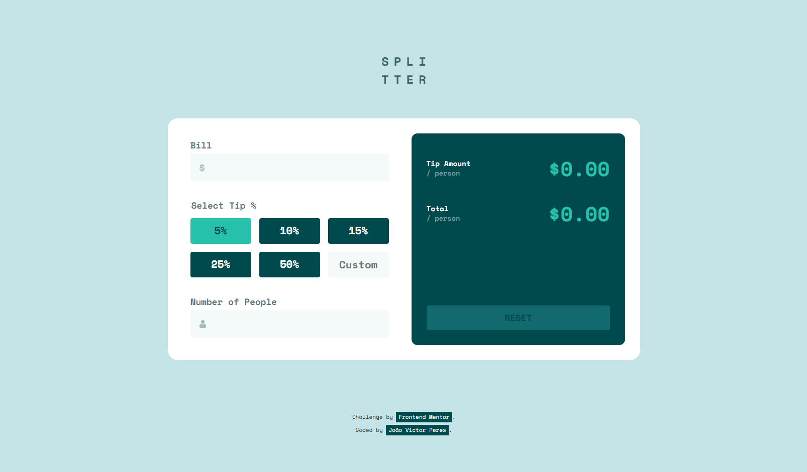

# Frontend Mentor - Tip calculator app solution

This is a solution to the [Tip calculator app challenge on Frontend Mentor](https://www.frontendmentor.io/challenges/tip-calculator-app-ugJNGbJUX). Frontend Mentor challenges help you improve your coding skills by building realistic projects.

## Table of contents

- [Overview](#overview)
  - [The challenge](#the-challenge)
  - [Screenshot](#screenshot)
  - [Links](#links)
- [My process](#my-process)
  - [Built with](#built-with)
  - [What I learned](#what-i-learned)
  - [Continued development](#continued-development)

## Overview

### The challenge

Users should be able to:

- View the optimal layout for the app depending on their device's screen size
- See hover states for all interactive elements on the page
- Calculate the correct tip and total cost of the bill per person

### Screenshot

### Links

- Live Site URL: [Tip Calculator App](https://tip-calculator-app-two-flax.vercel.app/)

## My process

### Built with

- Mobile-first workflow
- Semantic HTML5 markup
- CSS Grid e Flexbox
- JavaScript
- Lighthouse

### What I learned

In this project I tried to learn the mobile-first workflow. At the beggining it was confusing, but searching some tips on stackoverflow and programmer's advices on Youtubem, I realize what was necessary to make the calculator first for small screens, after for the desktops.

I liked this experience because I was not sure how to do that and also where to find the information to finish the project.

There are so much content on websites, Youtube and the support at the Slack and, that all those things make me feel more confident to try new things, like:

- Add and remove elements with JavaScript
- Add and remove classes of the HTML with JavaScript
- Edit css style with JavaScript
- Make the conditions of the operation of the calculator, including the erros and show to the user what was wrong
- Block some elements of the HTML according the erros that was showed, etc

All this problems were appering in the calculator, some hard to sold, others confusing to think, but in every one of then I develop my logic in HTML, CSS and specialy in JavaScript, because that's why I choose project.

### Continued development

In the next projets I will keep to focus on mobile-first workflow, because it is a very good way to start an organize the site.

Also I'm going to make the websites much accessible as possible, including semantic tags, aria-labels, etc in the HTML.

Some things that I will improve are the organization of the commits, code and make a path of what I have to do construct the site and just after this beggin to code.

